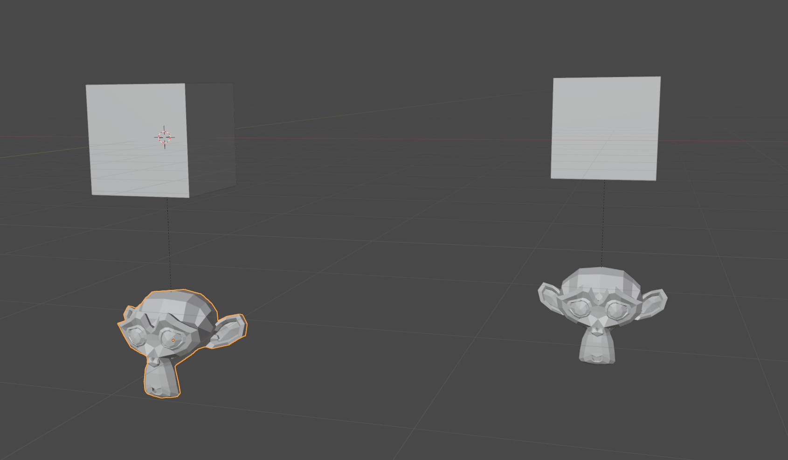
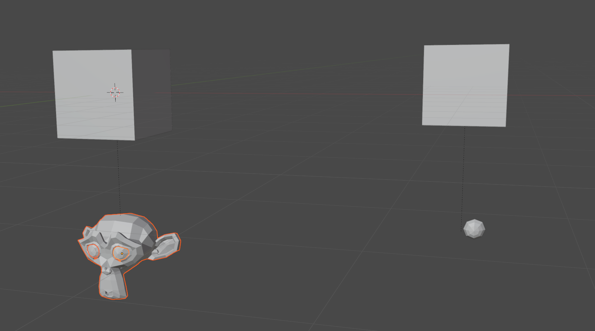
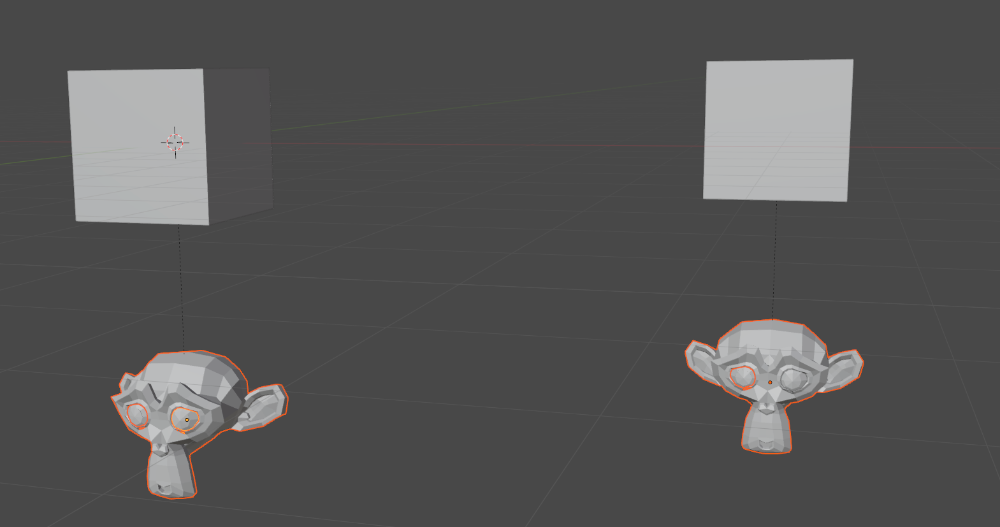

# Separate with Instances

Overrides the existing mesh separate operator
(default shortcut is `P`, in mesh edit mode)
with one extra feature:
it adds the new separate objects to other mesh instances in the scene.

Take this example.
A Suzanne is instanced twice, each with their own parent.
You want to split Suzanne up into separate objects.
Perhaps you only want one child instance to have eyes.
Give some variation, right?

So you separate Suzanne by loose parts.
You use the default separate operator, press `P`, and separate by loose parts.

Oh no! Now the other Suzanne instance doesn't have all its parts!
You'd have to duplicate all the new pieces to the new position _and_ reparent them.

Now imagine if you had hundreds instanced in your scene.
We can't have _that_, can we?

Here's the result with this add-on.
Each piece is duplicated per mesh instance,
preserving visual consistency prior to separation.
Separate pieces, but still in the same place!