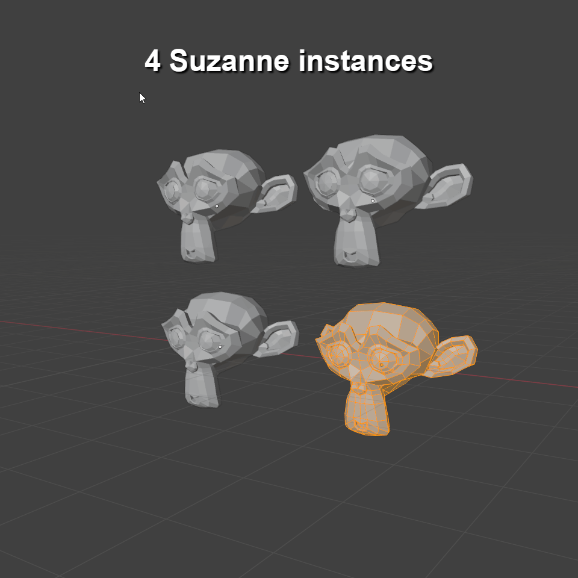

# Separate with Instances

Overrides the existing mesh separate operator
(default shortcut is `P`, in mesh edit mode)
with one extra feature:
it adds the new separate objects to other mesh instances in the scene.

Each piece is duplicated per mesh instance,
preserving visual consistency prior to separation.
Separate pieces, but still in the same place!

## Set Origin + Instances

Available in the Object menu in the 3D view.
Extends the "Set Origin" operation,
but updates the origin for all instances
in the current scene.

 